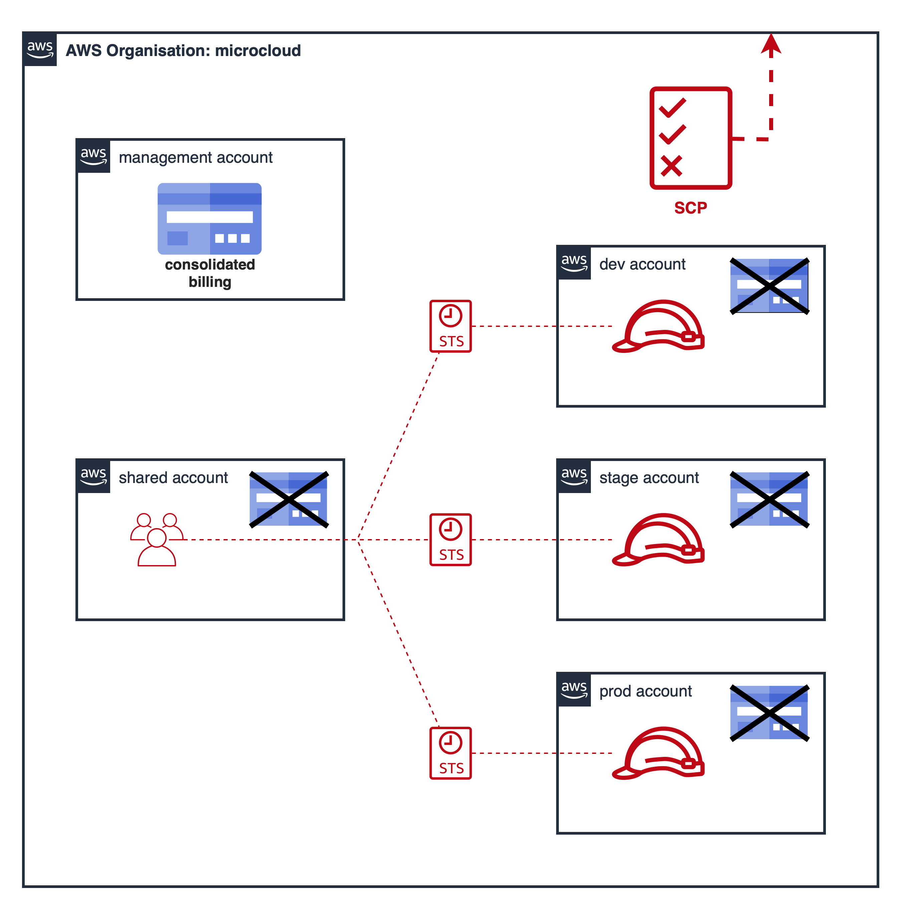

# terragrunt-aws-infrastructures
This terragrunt code provisions my test environment in AWS cloud (see [microcloud organization](#organization-microcloud)).
I use this environment to practice AWS concepts, prepare to AWS certificates and verify crazy ideas. Besides README.md,
further documentation can be found in commits, code comments and nested README files.
<br><br>
Feel free to explore and copy everything you want.
Enjoy!
<br><br>
Terragrunt use terraform modules from this repository: [terraform-aws-modules](https://github.com/mateusz-uminski/terraform-aws-modules)

# Requirements
1. Terraform version ~> 1.3.3
2. Terragrunt version ~> 0.39.2
3. AWS Accounts

# How to use?
0. Create config.yaml in the project's root directory according to the example-config.yaml

1. Deploy all modules
- plan all
```sh
terragrunt run-all plan
```
- apply all
```sh
terragrunt run-all apply
```
2. Deploy selected modules
- plan
```sh
cd dev-microcloud/eu-central-1/bootstrap/network
terragrunt run-all plan
```
- apply
```sh
cd dev-microcloud/eu-central-1/bootstrap/network
terragrunt run-all apply
```

# How to prepare an AWS Organization?
1. Create at least 3 (5 is ideal) AWS account: one for the management account, one for shared/central services such as IAM
 and one account for each environment (I decided for only one environment account to minimize costs).
2. Configure MFA on each account.
3. Create an AWS Organization on management account, set consolidated billing and invite other accounts to the organization.
4. Enable SCP in the organization.
5. On each account create cloudadmin IAM user, then attach directly existing policy `AdministratorAccess` to it.
6. Configure MFA for each cloudadmin user.
7. Generate AWS_ACCESS_KEY_ID and AWS_ACCESS_SECRET_KEY for each cloudadmin user.
8. Execute `cd mgmt-microcloud/us-east-1/organization && terragrunt run-all apply` and then attach AWS accounts to appropriate
organizational units.

# Project structure
Note: modules that configure global services should be places in the us-east-1 directory.
The code in this repo uses the following project structure ():
```
|
| - mgmt-account
| | - us-east-1
| | | - organization
| | | - scp
|
| - shared-account
| | - us-east-1
| | | - iam-groups
| | | - iam-roles
| | | - iam-users
| |
| | - eu-central-1
| | | - environment (dev, stage, prod)
| | | | - network
| | | | - projectA
|
| - dev-account
| | - us-east-1
| | | - projectA
| | | - environment (dev, stage, prod)
| | | | - network
| | | | - projectB
| |
| | - eu-central-1
| | | - environment (dev, stage, prod)
| | | | - network
| | | | - projectC
...
```

# Organization: microcloud
- [Organization design](##organization-design)
- [IAM design](##iam-design)
- [Network design](##network-design)
- [Resource tagging convention](##resource-tagging-convention)
- [Resource naming convention](##resource-naming-convention)

## Organization design



## IAM Design
todo

## Network design
todo

## Resource tagging convention
todo

## Resource naming convention
todo
